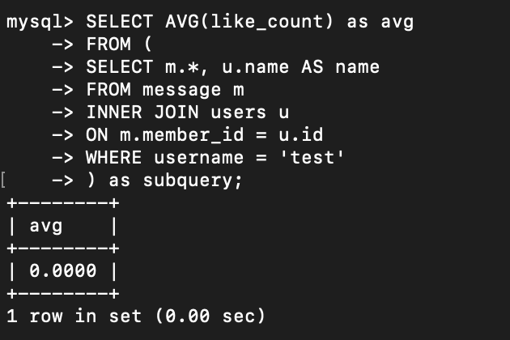

# Task2: database and table creation
1. create database named "website"
```sql
CREATE DATABASE website;
```
2. open "website" DB
```sql
USE website;
```
3. create table inside website DB
```sql
CREATE TABLE users (
    id BIGINT UNSIGNED AUTO_INCREMENT PRIMARY KEY,
    name VARCHAR(255) NOT NULL,
    username VARCHAR(255) NOT NULL,
    password VARCHAR(255) NOT NULL,
    follower_count INT UNSIGNED NOT NULL DEFAULT 0,
    time DATETIME NOT NULL DEFAULT CURRENT_TIMESTAMP
);
```
4. Image


# Task3: CRUD
1. Insert test data and 4 additional arbitrary datapoints
```sql
INSERT INTO users(name, username, password)
VALUES 
    ('Amy', 'amy', 'amy'),
    ('Bear', 'bear', 'bear'),
    ('Cat', 'cat', 'cat'),
    ('Emily', 'emily', 'emily');
```
2. select all rows from member table
```sql
SELECT *
FROM users;
```
### Results

3. select all rows from member table, in descending order of time
```sql
SELECT *
FROM users
ORDER BY time DESC;
```
### Results

4. select total 3 rows, from second to fourth from member table, in descending order to time
```sql
SELECT *
FROM users
ORDER BY time DESC
LIMIT 1, 3; -- limit starting from index 1 for 3 rows
```
### Results

5. select rows where username equals to 'test'
```sql
SELECT *
FROM users
WHERE username = "test";
```
### Results

6. select rows where name includes %es% keyword
```sql
SELECT *
FROM users
WHERE name LIKE "%es%";
```
### Results

7. select rows where both username and password equal to "test"
```sql
SELECT *
FROM users
WHERE username = "test" AND password = "test";
```
### Results

8. update data in name column to "test2" where username equals to "test"
```sql
UPDATE users
SET name = "test2"
WHERE username = "test";
```
### Results


# Task4: Aggregation
1. select how many rows from the member table
```sql
SELECT COUNT(*) AS total_rows
FROM users;
```
### Results

2. select the sum of follower_count of all rows from member table
*first update the follower counts of amy, bear, cat and emily to certain numbers for later calculation*
```sql
SELECT SUM(follower_count) AS sum_follower_count
FROM users;
```
### Results

3. select the average of follower_count of all rows from the member table
```sql
SELECT AVG(follower_count) AS avg_follower_count
FROM users;
```
### Results

4. select the average of follower_count of the first 2 rows, in descending order of follower_count from member table
```sql
SELECT AVG(follower_count) AS avg_follower_count -- 1300/2 =650
FROM (
    SELECT follower_count
    FROM users
    ORDER BY follower_count DESC
    LIMIT 2 -- 800+500 =1300 
) AS subquery;
```
### Results


# Task5: JOIN
1. Create a new table named message in the website database 
```sql
CREATE TABLE message (
    id BIGINT AUTO_INCREMENT PRIMARY KEY, 
    member_id BIGINT UNSIGNED NOT NULL, -- UNSIGNED
    FOREIGN KEY(member_id) REFERENCES users (id), -- reference to users table's 'id'
    content VARCHAR(255) NOT NULL, 
    like_count INT UNSIGNED NOT NULL DEFAULT 0, 
    time DATETIME NOT NULL DEFAULT CURRENT_TIMESTAMP);
```
### Results

2. select all messages, including sender names
```sql
SELECT m.*, u.name AS name, u.id
FROM message m
INNER JOIN users u
ON m.member_id = u.id;

```
### Results

3. select all messages, including sender names, where sender name = 'test'
```sql
SELECT m.*, u.name AS name
FROM message m
INNER JOIN users u
ON m.member_id = u.id
WHERE username = 'test';

```
### Results

4. get the average like count of messages where sender username equals to test.
```sql
SELECT AVG(like_count) as avg
FROM (
SELECT m.*, u.name AS name
FROM message m
INNER JOIN users u
ON m.member_id = u.id
WHERE username = 'test'
) as subquery;

```
### Results

5. get the average like count of messages GROUP BY sender username
```sql
SELECT u.username AS sender_username, AVG(m.like_count) AS avg_like_count
FROM message m
JOIN users u ON m.member_id = u.id
GROUP BY u.username;
task
```
### Results


## note on sqldump
command line on the terminal using username 'root' and database 'website'
```
mysqldump -u root -p website > data.sql
```
